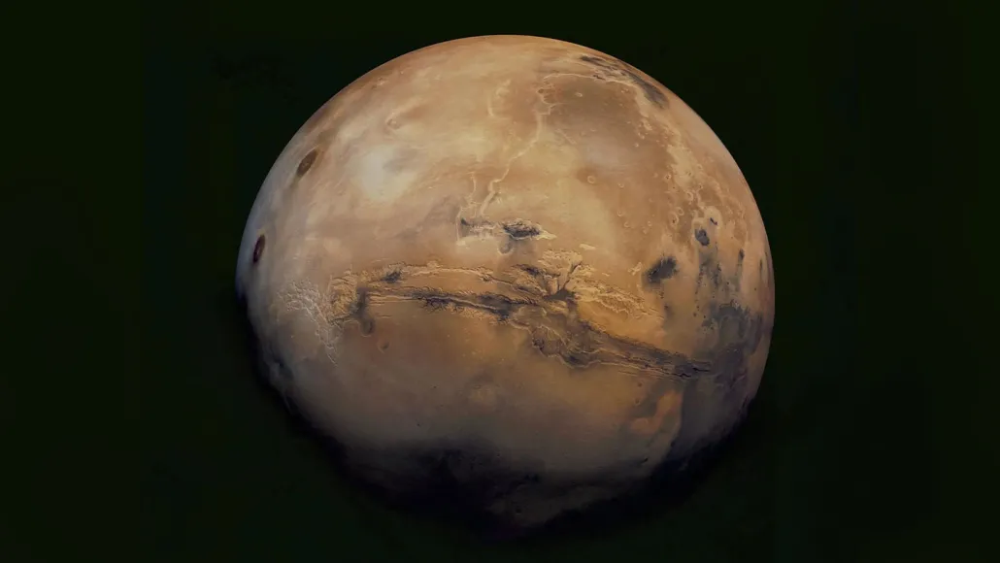

+++
title = 'Mars'
date = 2024-05-16T09:48:42-05:00
draft = true
tags = ['science','planets',]
+++

# Giant polygon rock patterns may be buried deep below Mars’ surface

Enormous polygon patterns in rock lie dozens of meters below Mars’ surface, ground-penetrating radar data suggest.

Similar patterns develop on the surface in Earth’s polar regions when icy sediments cool and contract. A comparable process long ago may have created the shapes on Mars, found near the planet’s dry equator, researchers report November 23 in Nature Astronomy.

If so, the finding hints that the Red Planet’s equator was much wetter and icier, more like a polar region, when the polygons formed 2 billion to 3 billion years ago.